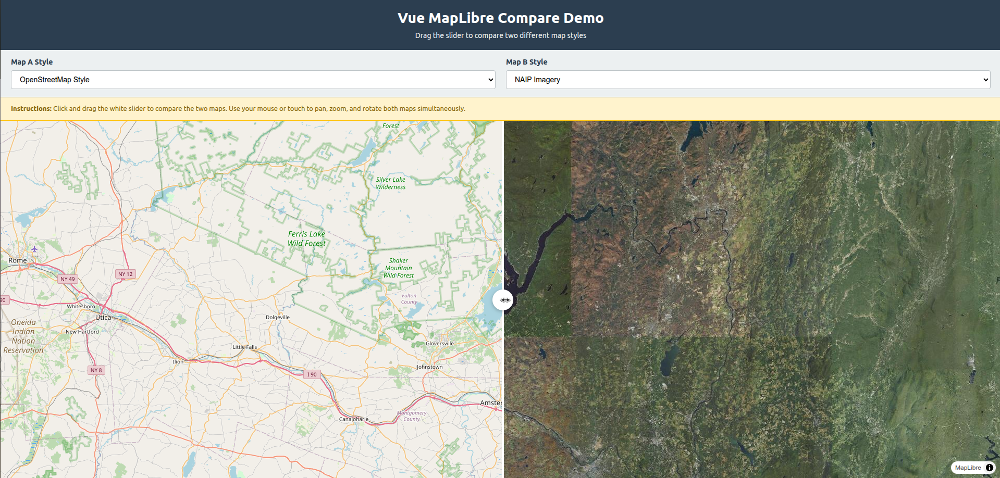

# vue-maplibre-compare

A Vue 3 component for comparing MapLibre maps side-by-side with a draggable slider. Perfect for visualizing differences between map styles or showing before/after comparisons.

## Features

- Side-by-side map comparison with smooth dragging slider
- Support for different MapLibre styles on each side, or same style with different layers
- Layer visibility control for both maps
- Touch and mouse support
- Built with Vue 3 and TypeScript using `defineComponent`
- Synchronized map movements (pan, zoom, rotate, pitch)
- Two main components: `MapCompare` (supports both different styles and same style with different layers), and `ToggleCompare` (toggleable comparison mode)

## Demo

**[Live Demo](https://bryonlewis.github.io/vue-maplibre-compare/)**




*Comparing two different map styles side-by-side with customizable swiper options*

## Installation

```bash
npm install vue-maplibre-compare maplibre-gl
```

## Usage

### As a Vue Plugin

```typescript
import { createApp } from 'vue'
import MapComparePlugin from 'vue-maplibre-compare'
import 'vue-maplibre-compare/dist/vue-maplibre-compare.css'
import App from './App.vue'

const app = createApp(App)
app.use(MapComparePlugin)
app.mount('#app')

// Now you can use the components in your templates:
// <MapCompare> and <ToggleCompare>
```

### As a Component

You can also import individual components:

```typescript
// Import specific components
import { MapCompare, ToggleCompare } from 'vue-maplibre-compare'
import 'vue-maplibre-compare/dist/vue-maplibre-compare.css'

// Or import all at once
import * as VueMaplibreCompare from 'vue-maplibre-compare'
```

```vue
<template>
  <div style="width: 100%; height: 600px;">
    <!-- Compare two different map styles -->
    <MapCompare
      :map-style-a="styleA"
      :map-style-b="styleB"
      :map-layers-a="layersA"
      :map-layers-b="layersB"
      :camera="{ center: [-74.5, 40], zoom: 9 }"
    />
    
    <!-- Or compare different layers from the same style (mapStyleB is optional) -->
    <MapCompare
      :map-style-a="styleA"
      :map-layers-a="layersA"
      :map-layers-b="layersB"
      :camera="{ center: [-74.5, 40], zoom: 9 }"
    />
  </div>
</template>

<script setup lang="ts">
import { ref } from 'vue'
import { MapCompare } from 'vue-maplibre-compare'

const styleA = 'https://demotiles.maplibre.org/style.json'
const styleB = 'https://demotiles.maplibre.org/style.json'

// Optional: specify which layers to show on each map
// If empty or not provided, all layers are shown
const layersA = ref(['water', 'roads', 'buildings'])
const layersB = ref(['water', 'buildings'])  // roads hidden on map B
</script>
```

### With Inline Styles

You can also pass MapLibre `StyleSpecification` objects directly:

```vue
<script setup lang="ts">
import { MapCompare } from 'vue-maplibre-compare'
import type { StyleSpecification } from 'maplibre-gl'

const blueStyle: StyleSpecification = {
  version: 8,
  sources: {},
  layers: [
    {
      id: 'background',
      type: 'background',
      paint: { 'background-color': '#1e3a8a' }
    }
  ]
}

const redStyle: StyleSpecification = {
  version: 8,
  sources: {},
  layers: [
    {
      id: 'background',
      type: 'background',
      paint: { 'background-color': '#991b1b' }
    }
  ]
}
</script>

<template>
  <MapCompare
    :mapStyleA="blueStyle"
    :mapStyleB="redStyle"
    :camera="{ center: [-74.5, 40], zoom: 9 }"
  />
</template>
```

### Comparing Layers from the Same Style

The `MapCompare` component supports comparing different layers from the same map style by omitting the `mapStyleB` prop. When `mapStyleB` is not provided, it defaults to `mapStyleA`:

```vue
<template>
  <div style="width: 100%; height: 600px;">
    <MapCompare
      :map-style-a="'https://demotiles.maplibre.org/style.json'"
      :map-layers-a="['water', 'roads']"
      :map-layers-b="['water', 'buildings', 'parks']"
      :camera="{ center: [-74.5, 40], zoom: 9 }"
    />
  </div>
</template>

<script setup lang="ts">
import { MapCompare } from 'vue-maplibre-compare'
import 'vue-maplibre-compare/dist/vue-maplibre-compare.css'
</script>
```

## Choosing the Right Component

This library provides two main components for map comparison. Here's when to use each:

### Use `MapCompare` when:

- **Always-on comparison**: You want to display two maps side-by-side at all times
- **Static comparison views**: The comparison state doesn't need to change dynamically
- **Simpler implementation**: You don't need toggle functionality or single-map mode
- **Performance**: You want a lighter component that only handles comparison mode

**Common use cases:**
- Before/after visualizations (e.g., showing map changes over time)
- Style comparison pages (comparing different map styles)
- Layer visibility comparisons (showing different layer combinations)
- Documentation or demo pages with fixed comparison views

### Use `ToggleCompare` when:

- **Dynamic toggling**: Users need to switch between single-map and comparison modes
- **Optional comparison**: Comparison is a feature that can be enabled/disabled
- **Space optimization**: You want to show a full-width map by default, with comparison as an option
- **User-controlled views**: Users should control when to compare maps
- **Map instance access**: You need direct access to map instances via `map-ready-a` and `map-ready-b` events

**Common use cases:**
- Interactive map applications with a "Compare" toggle button
- Map viewers where comparison is an optional feature
- Applications where users can choose to view one map or compare two
- Scenarios requiring programmatic access to map instances

### Quick Decision Guide

| Requirement | Component |
|------------|-----------|
| Always show two maps side-by-side | `MapCompare` |
| Need to toggle between single map and comparison | `ToggleCompare` |
| Simple, static comparison view | `MapCompare` |
| User-controlled comparison feature | `ToggleCompare` |
| Need map instance events (`map-ready-a`, `map-ready-b`) | `ToggleCompare` |
| Fixed comparison layout | `MapCompare` |

## Components

### MapCompare

Compare two different map styles side-by-side, or compare different layers from the same style.

**Props:**

| Prop | Type | Required | Default | Description |
|------|------|----------|---------|-------------|
| `mapStyleA` | `string \| StyleSpecification` | Yes | - | MapLibre style for left/first map |
| `mapStyleB` | `string \| StyleSpecification` | No | `mapStyleA` | MapLibre style for right/second map. If not provided, uses `mapStyleA` (useful for comparing different layers from the same style) |
| `mapLayersA` | `string[]` | No | `[]` | Array of layer IDs to enable in map A. If empty, all layers are shown |
| `mapLayersB` | `string[]` | No | `[]` | Array of layer IDs to enable in map B. If empty, all layers are shown |
| `camera` | `{ center: [number, number], zoom: number, pitch: number, bearing: number}`| Yes | `{ center: [-74.5, 40], zoom: 9, pitch: 0, bearing: 0 }` | Camera Location/Orientation settings
| `layerOrder` | `'topmost' or 'bottommost'` | No | `'topmost'` | Determines in what order layers should be rendered, topmost has the first layer as the highest in the stack, bottommost has the bottom layer as the highest in stack order |
| `transformRequest` | `function` **[Docs](https://maplibre.org/maplibre-gl-js/docs/API/type-aliases/RequestParameters/)** | No | `undefined` | transform invidual requests
| `headers` | `Record<string, any>` | No | `{}` | Headers to add to requests sent by the map NOTE: this will add to every map request, use transformRequest for more control |
| `attributionControl` | `AttributionControlOptions \| false` | No | `undefined` | Attribution control options or false to disable |
| `swiperOptions` | `SwiperOptions` | No | `default` | Configuration object for the swiper appearance and behavior |

**Emits:**

| Event | Payload | Description |
|-------|---------|-------------|
| `panend` | `{ center: [number, number], zoom: number, bearing: number, pitch: number }` | Emitted when the user finishes panning the map |
| `zoomend` | `{ center: [number, number], zoom: number, bearing: number, pitch: number }` | Emitted when the user finishes zooming the map |
| `pitchend` | `{ center: [number, number], zoom: number, bearing: number, pitch: number }` | Emitted when the user finishes changing the map pitch (tilt) |
| `rotateend` | `{ center: [number, number], zoom: number, bearing: number, pitch: number }` | Emitted when the user finishes rotating the map |
| `loading-complete` | `void` | Emitted when both maps have finished loading and are ready |
| `sliderend` | `{ percentage: number, position: number }` | Emitted when the user finishes dragging the slider. `percentage` is 0-100 representing how much of mapA is visible (0% = all mapB, 100% = all mapA). `position` is the pixel position of the slider. |


### SwiperOptions Interface

```typescript
interface SwiperOptions {
  thickness?: number;          // Width of the visible line (default: 4)
  orientation: 'vertical' | 'horizontal'; // Orientation of the slider
  grabThickness?: number;      // Width of the interactive area (default: 20)
  handleSize?: number;         // Diameter of the handle circle (default: 40)
  lineColor?: string;          // Color of the divider line (default: 'white')
  handleColor?: string;        // Color of the handle circle (default: 'white')
  handleShadowColor?: string;  // Color of the handle shadow
  arrowColor?: string;         // Color of the arrows
  darkMode?: boolean           // Swaps to darkmode if other colors aren't provided
}
```

### PMTiles Support

The component now includes built-in support for the `pmtiles` protocol. You can use `pmtiles://` URLs directly in your style sources.


### ToggleCompare

A hybrid component that can work in single-map mode or comparison mode. Perfect for scenarios where you want to toggle between showing one map or comparing two maps side-by-side.

**Props:**

| Prop | Type | Required | Default | Description |
|------|------|----------|---------|-------------|
| `mapStyleA` | `string \| StyleSpecification` | No | OpenStreetMap style | MapLibre style for the primary/left map |
| `mapStyleB` | `string \| StyleSpecification` | No | `undefined` | MapLibre style for the secondary/right map (only used when compareEnabled is true) |
| `mapLayersA` | `string[]` | No | `[]` | Array of layer IDs to enable in map A. If empty, all layers are shown |
| `mapLayersB` | `string[]` | No | `[]` | Array of layer IDs to enable in map B. If empty, all layers are shown |
| `camera` | `{ center: [number, number], zoom: number, pitch: number, bearing: number}`| No | `{ center: [0, 0], zoom: 1, pitch: 0, bearing: 0 }` | Camera Location/Orientation settings |
| `compareEnabled` | `boolean` | No | `false` | Whether comparison mode is enabled. When false, shows only mapStyleA |
| `layerOrder` | `'topmost' or 'bottommost'` | No | `'topmost'` | Determines in what order layers should be rendered |
| `transformRequest` | `function` | No | `undefined` | Transform individual requests |
| `headers` | `Record<string, string>` | No | `{}` | Headers to add to requests sent by the map |
| `mapContainerId` | `string` | No | `'mapContainer'` | ID for the map container element |
| `attributionControl` | `AttributionControlOptions \| false` | No | `undefined` | Attribution control options or false to disable |
| `swiperOptions` | `SwiperOptions` | No | `default` | Configuration object for the swiper appearance and behavior |

**Emits:**

| Event | Payload | Description |
|-------|---------|-------------|
| `panend` | `{ center: [number, number], zoom: number, bearing: number, pitch: number }` | Emitted when the user finishes panning the map |
| `zoomend` | `{ center: [number, number], zoom: number, bearing: number, pitch: number }` | Emitted when the user finishes zooming the map |
| `pitchend` | `{ center: [number, number], zoom: number, bearing: number, pitch: number }` | Emitted when the user finishes changing the map pitch (tilt) |
| `rotateend` | `{ center: [number, number], zoom: number, bearing: number, pitch: number }` | Emitted when the user finishes rotating the map |
| `loading-complete` | `void` | Emitted when the map(s) have finished loading and are ready |
| `sliderend` | `{ percentage: number, position: number }` | Emitted when the user finishes dragging the slider. `percentage` is 0-100 representing how much of mapA is visible (0% = all mapB, 100% = all mapA). `position` is the pixel position of the slider. |
| `map-ready-a` | `MaplibreMap` | Emitted when map A is ready, provides the map instance |
| `map-ready-b` | `MaplibreMap` | Emitted when map B is ready, provides the map instance (only in compare mode) |

**Usage:**

```vue
<template>
  <div style="width: 100%; height: 600px;">
    <ToggleCompare
      :mapStyleA="primaryStyle"
      :mapStyleB="secondaryStyle"
      :compareEnabled="isComparing"
      :camera="{ center: [-74.5, 40], zoom: 9 }"
      @map-ready-a="onMapAReady"
      @map-ready-b="onMapBReady"
    />
    <button @click="isComparing = !isComparing">
      {{ isComparing ? 'Single Map' : 'Compare Maps' }}
    </button>
  </div>
</template>

<script setup lang="ts">
import { ref } from 'vue'
import { ToggleCompare } from 'vue-maplibre-compare'
import type { Map as MaplibreMap } from 'maplibre-gl'

const isComparing = ref(false)
const primaryStyle = 'https://demotiles.maplibre.org/style.json'
const secondaryStyle = 'https://example.com/other-style.json'

const onMapAReady = (map: MaplibreMap) => {
  console.log('Map A ready:', map)
}

const onMapBReady = (map: MaplibreMap) => {
  console.log('Map B ready:', map)
}
</script>
```

## Development

### Setup

```bash
git clone <repository-url>
cd vue-maplibre-compare
npm install
```

### Run Demo

```bash
npm run dev
```

This will start a development server at `http://localhost:3000` with a demo application showing the component in action.

### Build Library

```bash
npm run build
```

This will create the distributable library files in the `dist` directory.

### Versioning and Publishing

This project uses semantic versioning with [standard-version](https://github.com/conventional-changelog/standard-version). See [VERSIONING.md](./VERSIONING.md) for detailed information about:

- How to bump versions locally
- Publishing via GitHub Actions workflow
- Commit message conventions
- Best practices

Quick version commands:
```bash
npm run version        # Auto-detect version bump from commits
npm run version:patch  # Bump patch version (1.0.0 -> 1.0.1)
npm run version:minor  # Bump minor version (1.0.0 -> 1.1.0)
npm run version:major  # Bump major version (1.0.0 -> 2.0.0)
```


